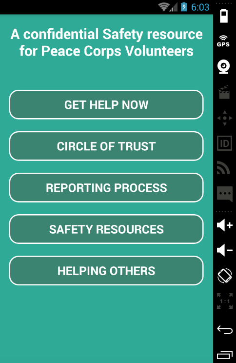

# PCSA

## Introduction

PCSA Android is an Android app developed in Java

Peace Corps is committed to providing a compassionate and supportive response to all Volunteers who have been sexually assaulted. To that end, the Peace Corps makes the following commitment to our Volunteers who are victims of sexual assault.

This project is to support the initiative by creating a mobile app that PCVs can readily have accessible to report or gain information on Peace Corps Safety and Security procedures.

You can learn more about the Systers organization, whose members work on the development of this app [here](http://anitaborg.org/get-involved/systers/) and join our mailing list [here](http://systers.org/mailman/listinfo/systers)

## Getting Started

Download [Android Studio](http://developer.android.com/sdk/index.html) and the required SDK tools or get the Eclipse ADT plugin

###Installation:
Go to your terminal and execute this command

    $ git clone https://github.com/systers/PCSA-Android

Or download the ZIP file from above

###Opening and Running 

Open Android Studio and choose the option to open an existing project. 

Navigate to the project and select the folder named 'PCSA-Android'.

Press the play button inside Android Studio, choose the emulator, and the PCSA app should now be running. 

## Documentation
Latest documentation for PCSA can be found [here](https://github.com/systers/PCSA-Android/tree/develop/docs)

## Contributing
If you want to contribute to PCSA-Android, subscribe to our [systers-dev](http://systers.org/mailman/listinfo/systers-dev) mailing list and shoot an introductory email. Pick an open issue from the [issue list](https://github.com/systers/PCSA-Android/issues) claim it in the comments, fix the issue and send us a pull request. 
If you find an issue yourself you can report it, a community member will get back to you and approve the issue. Then you can fix it and submit a PR. Please go through our issue list first and make sure the issues you are reporting  do not replicate the issues already reported. If you have issues on multiple pages, report them separately. Do not combine them into a single issue.

### Avoid doing the following mistakes
1. Fix a new issue and submit a PR without reporting and getting it approved at first.
2. Fix an issue assigned to somebody else and submit a PR before the assignee does. 
3. Report issues which are previously reported by others. (Please check the closed issues too before you report an issue). 
4. Suggest completely new developments in the issue list. (Please use the mailing list for this kind of suggestions. Use issue list to suggest bugs/features in the already implemented sections.)

### Best Practices
1. Please use meaningful commit messages in PRs.
2. Do not over commit (Use more than one commit for a small change).
3. Please use separate PRs for separate issues/tasks

## Troubleshooting/Issues

If there are any problems encountered when installing the IDE, you may want to check and make sure you have a JDK and JRE installed. If you experience trouble building or running the project, you may not have the necessary build tools, which you can download directly through the IDE. If the app does not run on the emulator, it may be that the emulator is too slow, and you should look into installing one from an outside source. 

If there are any other questions or concerns, please contact the Systers contributors. 

